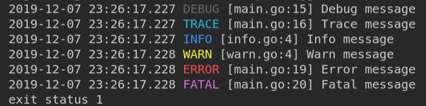

# simple-logger
golang simpler logger

## Env var options
- LOG_LEVEL `[ debug, trace, info, warn, error, fatal ]` sets logging level
- LOG_LEVEL `[ 6, 5, 4, 3, 2, 1 ]` can use numbers instead
- LOG_DATE `[ false, 0 ]` remove date line from logs
- LOG_COLOR `[ false, 0 ]` remove color from logs
- LOG_FUNC `[ false, 0 ]` remove function from logs
- LOG_UTC `[ false, 0 ]` use local time instead of UTC from logs

## Example

```bash
go get -u github.com/casonadams/simple-logger
```

```go
package main

import logger "github.com/casonadams/simple-logger"

func main() {
	log := logger.NewLogger("test")
	log.Debug("debug message")
	log.Trace("trace message")
	log.Info("Hello World")
	log.Warn("Warn message")
	log.Error("this is an error")
	log.Panic("panic")
}

```

## Run

```bash
LOG_LEVEL=debug go run .
```



